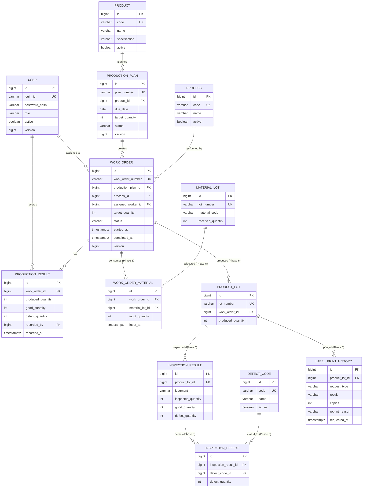

# peS Phase 0: 참고자료 분석과 MVP 설계

## 1. 문서의 범위와 판정 기준

이 문서는 참고 MES에서 확인한 업무 개념과 peS에 새로 적용할 설계를 분리한다. 참고 MES의 구현을 정답으로 간주하거나 그대로 재현하지 않는다.

판정 용어는 다음과 같다.

- **코드에서 확인됨**: 컨트롤러, 도메인 객체, 매퍼 SQL 또는 마이그레이션에서 데이터 흐름이나 필드를 직접 확인했다.
- **파일명으로만 추정됨**: 이름은 업무 기능을 암시하지만, 해당 이름만으로 업무 규칙이나 데이터 정합성을 보장한다고 판단할 수 없다.
- **새 프로젝트를 위한 제안**: peS의 범위와 기술 스택에 맞게 독립적으로 정한 정책이다.

근거 경로는 로컬 참고자료 루트인 `materialspark-mes/` 기준 상대 경로다. 해당 자료는 peS 저장소에 포함하지 않는다. 소스 내용, 실제 식별자, 네트워크 정보, 계정, 설정값 및 실제 데이터도 이 문서에 옮기지 않았다.

## 2. 참고 MES에서 가져올 업무 개념

### 2.1 생산계획과 작업지시의 관계

**코드에서 확인됨**

- 설비, 품목, 근무 구분, 계획일, 제조조건을 가진 작업지시 계획 모델이 별도로 존재한다. 근거: `src/main/java/mes/domain/wm/WorkOrderPlanVo.java`, `src/main/resources/mappers/wm/workOrderPlanMapper.xml:5-32`.
- 작업지시 생성 시 선택된 계획을 다시 조회하고 계획의 품목, 일자, 근무 구분, 제조조건 등을 작업지시 객체에 복사한 뒤 작업지시를 생성한다. 즉, 계획이 작업지시 생성의 입력으로 사용되는 흐름은 확인된다. 근거: `src/main/java/mes/web/wm/WorkOrderPlanController.java:1550-1615`.
- 작업지시 헤더는 작업지시번호, 품목, 설비, 상태, 담당자, 목표 및 실적 관련 필드를 가진다. 근거: `src/main/java/mes/domain/po/WorkOrderVo.java:8-85`, `src/main/resources/mappers/po/workOrderMapper.xml:981-1016`.

다만 확인한 생성 SQL에는 생산계획의 식별자를 작업지시에 FK로 저장하는 부분이 보이지 않는다. 따라서 참고 MES가 계획과 작업지시의 명시적인 1:N 관계를 DB에서 보장한다고 단정할 수 없다.

**파일명으로만 추정됨**

- 월 생산계획, 설비별 계획, 작업지시 계획이 여러 파일로 나뉘어 있어 계획 계층이 여러 개일 가능성은 있다. 근거: `MonthProductionPlanController.java`, `WorkOrderPlanController.java`, `monthProductionPlanMapper.xml`. 이 이름만으로 상위 계획과 작업지시 사이의 카디널리티나 확정 규칙은 판단하지 않는다.

**새 프로젝트를 위한 제안**

- `ProductionPlan 1:N WorkOrder`를 명시적인 FK로 설계한다.
- 확정된 계획만 작업지시를 만들 수 있게 하고, 작업지시 목표수량 합계가 계획수량을 넘지 않게 같은 트랜잭션에서 검증한다.
- 작업지시에는 사람이 읽는 고유 번호를 두되, 번호 문자열에 업무 관계를 인코딩하지 않는다. 관계의 진실은 FK가 담당한다.

### 2.2 작업지시 상태와 작업자 처리 흐름

**코드에서 확인됨**

- 참고 MES는 작업지시에 작업 상태, 시작시각, 종료시각, 주/부 담당자를 저장한다. 근거: `src/main/java/mes/domain/po/WorkOrderVo.java:28-39`, `src/main/java/mes/domain/po/WorkOrderVo.java:83-85`.
- 상태 변경 컨트롤러에는 미발행/발행/진행/완료에 해당하는 여러 분기와 시작, 진행 취소, 완료 취소, 종료 처리가 존재한다. 진행 중 작업이 있는 설비에 새 작업을 시작하지 못하게 확인하는 조회도 있다. 근거: `src/main/java/mes/web/po/WorkOrderController.java:1617-1665`, `src/main/java/mes/web/po/WorkOrderController.java:1829-1905`, `src/main/java/mes/web/po/WorkOrderController.java:2029-2169`, `src/main/resources/mappers/po/workOrderMapper.xml:3020-3031`.
- 상태 변경 SQL은 시작/종료 시각 및 일부 수량을 함께 변경한다. 근거: `src/main/resources/mappers/po/workOrderMapper.xml:1061-1088`.

상태 변경 SQL 자체는 이전 상태를 `WHERE` 조건으로 비교하지 않는다. 컨트롤러 검증과 DB 동시성 제어가 하나의 불변식을 보장하는지는 확인한 파일만으로 단정할 수 없다.

**파일명으로만 추정됨**

- `WorkerChangeVo`와 관련 매퍼 이름은 작업자 교대 이력이 있음을 암시한다. 근거: `src/main/java/mes/domain/po/WorkerChangeVo.java`, `workOrderMapper.xml`의 작업자 변경 구간. peS MVP에 교대 기능이 필요하다는 뜻은 아니다.

**새 프로젝트를 위한 제안**

- MVP 상태는 `WAITING → IN_PROGRESS → COMPLETED` 단방향만 둔다.
- `start()`와 `complete()`라는 명령형 서비스 메서드/API를 사용하고 범용 상태 수정 API는 만들지 않는다.
- 배정된 작업자만 시작과 실적 등록을 할 수 있다. `MANAGER`와 `ADMIN`은 조회 및 운영 명령 권한을 갖되, 권한은 서버 API에서 검증한다.
- 완료 후 재시작, 중복 완료, 완료 후 실적 추가는 서버에서 거부한다.
- 결과 등록과 완료 트랜잭션은 작업지시 행을 잠가 동시 요청을 직렬화하고, 일반 수정 충돌 감지를 위해 `@Version`도 둔다.

### 2.3 자재 투입 정보와 LOT 조회 방식

**코드에서 확인됨**

- 작업지시 상세에는 한 작업지시에 여러 자재 LOT/바코드가 연결된다. 상세 행은 자재코드, 검사수량, 양품/불량수량, 재투입 여부, 상태 등을 가진다. 근거: `src/main/resources/mappers/po/workOrderMapper.xml:1187-1220`, `src/main/resources/mappers/po/workOrderMapper.xml:1312-1343`.
- 바코드로 입고 자재를 조회하면서 작업지시 품목에 허용된 자재인지 확인하고, 같은 작업지시에 이미 투입되었는지도 검사한다. 근거: `src/main/java/mes/web/po/WorkOrderController.java:915-949`, `src/main/resources/mappers/po/workOrderMapper.xml:1118-1159`, `src/main/resources/mappers/po/workOrderMapper.xml:1280-1292`.
- LOT 추적 조회는 작업지시, 작업지시 자재 상세, 생산실적, 입고 자재 정보를 LOT와 작업지시번호로 연결한다. 근거: `src/main/java/mes/web/wm/LotTraceController.java:27-79`, `src/main/resources/mappers/wm/lotTraceMapper.xml:87-145`, `src/main/resources/mappers/wm/lotTraceMapper.xml:293-500`.

**파일명으로만 추정됨**

- `lotTraceMapper.xml`이라는 이름만으로 완전한 정방향/역방향 계보, 수량 보존 또는 모든 공정 단계 추적을 보장한다고 볼 수 없다. 확인한 쿼리는 여러 테이블을 조회하지만 전체 시스템의 정합성 규칙까지 증명하지 않는다.

**새 프로젝트를 위한 제안**

- Phase 5에서 `MaterialLot`과 연결 엔티티 `WorkOrderMaterial`을 추가하여 `WorkOrder N:M MaterialLot`을 정확히 표현한다.
- 생산 결과로 생기는 `ProductLot`은 작업지시를 참조하고, 필요하면 생산실적도 참조한다. 추적 조회는 `MaterialLot → WorkOrderMaterial → WorkOrder → ProductLot` 경로를 사용한다.
- MVP(Phase 1~4)에는 LOT를 억지로 넣지 않는다. 대신 모든 핵심 엔티티에 안정적인 내부 ID와 감사 시각을 두어 Phase 5에서 관계를 추가할 수 있게 한다.

### 2.4 생산실적의 기록 단위와 수량 처리

**코드에서 확인됨**

- 생산실적 객체는 작업지시번호뿐 아니라 생산 LOT, 전표 성격의 LOT, 투입 자재 LOT, 순번, 생산수량과 검사 단계별 수량을 가진다. 근거: `src/main/java/mes/domain/po/WorkOrdOutputSubVo.java:6-35`, `src/main/java/mes/domain/po/WorkOrdOutputSubVo.java:40-67`.
- 실적 목록과 등록 SQL은 작업지시/생산 LOT/자재 LOT를 함께 저장하며 작업지시 단위 합계를 계산한다. 근거: `src/main/resources/mappers/po/workOrdOutputSubMapper.xml:247-302`, `src/main/resources/mappers/po/workOrdOutputSubMapper.xml:519-576`, `src/main/resources/mappers/po/workOrdOutputSubMapper.xml:739-748`.
- 작업지시 종료 전 자재 LOT별 실적 존재 여부를 확인하려는 코드가 있다. 근거: `src/main/java/mes/domain/po/WorkOrdOutputSubVo.java:34-38`, `src/main/java/mes/web/po/WorkOrderController.java:2032-2081`.

참고 MES의 여러 생산/검사 수량 필드는 특정 공정에 맞춰져 있다. 이 구현이 peS에서 정의할 `생산수량 = 양품수량 + 불량수량` 규칙과 정확히 같다고 단정하지 않는다.

**파일명으로만 추정됨**

- `ProductionPerfTray` 관련 파일은 트레이 단위 실적을 암시하지만, peS의 단순 부품 생산 시나리오에 트레이가 필요하다는 근거는 아니다.

**새 프로젝트를 위한 제안**

- `ProductionResult` 한 행을 작업자가 한 번 제출한 증분 실적 이벤트로 정의한다. 하나의 작업지시는 여러 실적 행을 가진다.
- 각 행에 `producedQuantity`, `goodQuantity`, `defectQuantity`, `recordedBy`, `recordedAt`을 저장한다.
- 모든 수량은 0 이상이고 `producedQuantity = goodQuantity + defectQuantity`여야 한다. Bean Validation, 도메인 서비스, DB `CHECK` 제약으로 중복 방어한다.
- MVP에서는 목표 초과 생산을 허용하지 않는다. 누적 생산수량이 목표수량을 넘으면 `409 Conflict`로 거부한다.
- 실적은 추가 전용으로 시작한다. 정정/취소 이벤트는 실제 시연 필요가 생길 때 별도 설계한다.

### 2.5 검사 결과와 불량코드의 관계

**코드에서 확인됨**

- 검사 화면은 생산실적을 조회한 뒤 검사수량에서 불량수량을 차감해 양품수량을 계산하는 흐름을 가진다. 근거: `src/main/java/mes/web/qm/GoodsInspectController.java:200-332`, `src/main/java/mes/web/qm/GoodsInspectController.java:772-816`.
- 불량 상세는 작업지시, 생산 LOT, 검사일, 대/소분류 코드, 불량수량, 검사자와 순번을 함께 저장한다. 근거: `src/main/resources/mappers/qm/goodsInspectMapper.xml:1581-1614`, `src/main/resources/mappers/qm/goodsInspectMapper.xml:1629-1677`.
- 불량코드는 별도 기준정보로 관리되며 사용 여부를 가진다. 근거: `src/main/java/mes/domain/qm/FaultyCommonCodeVo.java:7-30`, `src/main/resources/mappers/qm/faultyCommonCodeMapper.xml:30-62`, `src/main/resources/mappers/qm/faultyCommonCodeMapper.xml:96-166`.

**파일명으로만 추정됨**

- 엣지, 외관, 출하, 신뢰성 등 다수 검사 파일명이 존재하지만 각 검사의 선후관계나 최종 합격 판정 규칙은 파일명만으로 확정하지 않는다.

**새 프로젝트를 위한 제안**

- Phase 5에서 `InspectionResult`를 검사 사건으로 두고 `ProductLot`에 연결한다.
- 한 검사에서 여러 불량 유형을 기록할 수 있으므로 `InspectionDefect` 연결 엔티티가 `InspectionResult N:M DefectCode`와 각 불량수량을 표현한다.
- 검사 판정은 `PASS`/`FAIL`로 명시하고, 불량 상세 합계가 검사 불량수량과 일치하도록 검증한다.
- 작업 완료는 검사 합격을 뜻하지 않으며, 검사 합격도 가용 재고 반영을 뜻하지 않는다.

### 2.6 라벨 발행과 재출력 이력

**코드에서 확인됨**

- 라벨/박스 단위 및 더 세부적인 단위의 출력 횟수를 분리해 누적하는 마이그레이션과 조회/증가 API가 존재한다. 근거: `src/main/resources/db/migration/common/V20260526_003__common_add_print_cnt_to_tb_production_perf_tray.sql:1-54`, `src/main/resources/db/migration/common/V20260722_001__common_add_tray_print_cnt.sql:1-39`, `src/main/java/mes/web/po/ProductionPerfTrayController.java:3126-3193`.
- 기존 구현도 출력 대상의 단위가 다르면 같은 카운터를 재사용할 수 없음을 별도 컬럼으로 다룬다. 근거: `src/main/resources/db/migration/common/V20260722_001__common_add_tray_print_cnt.sql:4-12`.
- 출력 실패에는 발생시각, 출력 대상, 사용자, 오류 분류, 처리상태 등을 남기는 별도 이력 구조가 있다. 근거: `src/main/java/mes/domain/sm/LabelPrintErrLogVo.java:15-67`, `src/main/resources/db/migration/common/V20260818_001__common_label_printer_err_and_check.sql:32-110`.

출력 카운트 증가는 실제 프린터 통신과 분리된 경로도 있으므로, 카운트만으로 물리적 출력 성공을 보장한다고 해석하면 안 된다.

**파일명으로만 추정됨**

- 여러 화면의 `RePrint` 버튼 이름은 재출력 기능 존재를 암시하지만, 버튼 이름만으로 재출력 사유와 성공 여부가 감사 이력으로 모두 남는지는 판단할 수 없다.

**새 프로젝트를 위한 제안**

- Phase 6 확장 기능으로 재고 수불보다 라벨 이력을 우선한다. LOT 추적 시연과 자연스럽게 이어지고 범위가 작다.
- 단순 카운터가 아니라 `LabelPrintHistory`에 대상 LOT, 최초/재출력 구분, 요청자, 요청시각, 매수, 재출력 사유, 요청 결과를 한 건씩 기록한다.
- 이력은 중복 라벨 사용 위험을 알리고, 누가 언제 왜 재출력했는지 설명하며, 요청과 실제 성공을 구분하기 위해 필요하다.

### 2.7 메뉴 권한과 DB 마이그레이션

**코드에서 확인됨**

- 메뉴 정보와 메뉴 권한이 분리돼 있고 사용자/조직 기준으로 허용된 메뉴 경로를 조회한다. 별도의 특수 권한과 권한 사용 이력도 존재한다. 근거: `src/main/java/mes/domain/sm/MenuAuthVo.java:7-39`, `src/main/resources/mappers/sm/menuAuthMapper.xml:38-102`, `src/main/resources/mappers/sm/menuAuthMapper.xml:186-247`.
- 인터셉터에는 메뉴 경로 기반 검사 로직이 있지만 일부 접근 검사는 주석 처리돼 있고 AJAX 파라미터에 의존하는 부분도 있다. 근거: `src/main/java/mes/interceptor/LoginInterceptor.java:105-162`, `src/main/java/mes/interceptor/LoginInterceptor.java:182-210`, `src/main/java/mes/interceptor/LoginInterceptor.java:275-315`.
- Flyway 설정은 마이그레이션 검증, 순서 고정, clean 비활성화, 적용 위치 분리를 고려한다. 근거: `src/main/java/mes/config/FlywayConfig.java:12-74`.
- 마이그레이션 문서는 스키마 변경과 환경별 데이터 변경 분리, 적용된 버전 파일 불변, 새 버전으로 보정, 업무 데이터 핫픽스 분리 원칙을 둔다. 근거: `src/main/resources/db/migration/README.md:5-18`, `src/main/resources/db/migration/README.md:31-74`.

**파일명으로만 추정됨**

- 메뉴/권한 마이그레이션 파일명은 메뉴 배포와 권한 데이터 배포를 함께 처리함을 암시한다. 하지만 파일명만으로 모든 API가 서버 측 권한 검사를 거친다고 볼 수 없다.

**새 프로젝트를 위한 제안**

- 프론트 메뉴 숨김은 편의 기능으로만 사용하고, 모든 API는 Spring Security의 URL/메서드 권한으로 재검증한다.
- `ADMIN`, `MANAGER`, `WORKER` 고정 역할로 시작한다. 메뉴별 동적 ACL은 MVP에서 제외한다.
- PostgreSQL용 Flyway 버전 마이그레이션을 첫 스키마부터 사용한다. 적용된 파일은 수정하지 않고 새 파일로 보정하며 `clean`은 비활성화한다.
- 스키마 마이그레이션과 시연 데이터 생성을 분리한다. 개발 시드 위치/프로필은 운영에서 로드할 수 없게 한다.
- 참고 MES의 기존 DB baseline, 환경별 공장 분기, SQL Server 전용 설정은 peS로 옮기지 않는다.

## 3. 반영할 개념과 버릴 복잡성

| 구분 | 반영 | 초기 범위에서 제외 |
|---|---|---|
| 계획 | 계획에서 여러 작업지시를 파생, 계획 대비 배정/실적 집계 | 월간 동적 피벗, 설비 CAPA 자동계산, 확정판/변경판 |
| 작업 | 명시적 상태 전환, 담당자, 시작/완료 시각 | 주야조, 교대 이력, 완료 취소, 재작업, 설비별 동시작업 규칙 |
| 실적 | 여러 번의 증분 등록, 양품/불량/생산수량 불변식 | 트레이/박스, 중량 기반 환산, 비전·설비 자동수집 |
| LOT | 작업지시와 자재 LOT의 다대다, 생산 LOT 계보 | 재투입, 복수 공장별 LOT 채번, 포장/출하 계보 |
| 품질 | 검사 사건과 불량코드 상세 | 공정별 특수 검사, 다단 승인, 자동판정 설비 연동 |
| 보안 | 역할 기반 API 권한, 안전한 비밀번호 해시 | 부서/개인 혼합 동적 메뉴 ACL, 대리 권한 |
| 인프라 | 단일 Spring Boot API, React SPA, PostgreSQL | Redis, Kafka, WebSocket, PLC, MSA, Kubernetes |

참고 MES의 공장별 분기, 대규모 단일 컨트롤러, MyBatis SQL, JSP 화면, 코드값 및 테이블 구조는 재사용하지 않는다.

## 4. 가상 공장 MVP 시나리오

가상 공장은 한 종류의 소형 금속 브래킷을 단일 조립 공정으로 생산한다. 이름, 코드, 사용자 및 수치는 모두 개발 시드에서 생성한 가상 값만 사용한다.

1. `ADMIN`이 사용자 계정을 만들고 `MANAGER`, `WORKER` 역할을 배정한다.
2. `MANAGER`가 품목과 단일 공정을 등록한다.
3. `MANAGER`가 납기일과 목표수량을 가진 생산계획을 작성하고 확정한다.
4. `MANAGER`가 계획수량을 나누어 하나 이상의 작업지시를 생성하고 작업자를 배정한다.
5. 배정된 `WORKER`가 자신의 `WAITING` 작업지시를 시작한다.
6. 작업자는 여러 번에 걸쳐 생산수량, 양품수량, 불량수량을 증분 실적으로 등록한다.
7. 누적 생산수량이 목표수량과 같아지면 작업을 완료한다.
8. `MANAGER`가 계획→작업지시→실적 상세와 대시보드 집계가 일치하는지 확인한다.

Phase 4까지의 명시적 비범위는 자재 LOT, 생산 LOT, 검사 판정, 라벨, 재고다. 따라서 작업 완료 시 재고를 증가시키지 않는다.

## 5. 상태 전환과 핵심 정책

### 5.1 생산계획

| 현재 | 명령 | 다음 | 허용 조건 | 거부 조건 |
|---|---|---|---|---|
| DRAFT | confirmPlan | CONFIRMED | 품목, 납기일, 목표수량이 유효 | 이미 확정, 목표수량 0 이하 |
| DRAFT | edit/delete | DRAFT/삭제 | 작업지시 없음 | 작업지시 존재 |
| CONFIRMED | createWorkOrder | CONFIRMED | 미배정 계획수량 이내 | 작업지시 목표 합계가 계획 초과 |

확정 계획은 MVP에서 되돌리거나 핵심 값을 수정하지 않는다. 계획 완료율은 별도 상태가 아니라 작업지시 실적 합계로 계산한다.

### 5.2 작업지시

| 현재 | 명령 | 다음 | 서버 규칙 |
|---|---|---|---|
| WAITING | startWorkOrder | IN_PROGRESS | 활성 작업자에게 배정돼 있어야 하며 요청자는 배정 작업자여야 한다. 시작시각을 기록한다. |
| IN_PROGRESS | recordProductionResult | IN_PROGRESS | 수량 불변식을 만족하고 누적 생산수량이 목표를 넘지 않아야 한다. |
| IN_PROGRESS | completeWorkOrder | COMPLETED | 실적이 1건 이상이고 누적 생산수량이 목표수량과 정확히 같아야 한다. 완료시각을 기록한다. |
| COMPLETED | 모든 변경 명령 | 거부 | 재시작, 실적 추가, 중복 완료를 `409 Conflict`로 거부한다. |

일시정지, 취소, 재시작, 부분 완료는 MVP에 넣지 않는다. 필요성이 생기면 상태와 감사 정책을 먼저 추가한 뒤 구현한다.

### 5.3 수량과 동시성

- `produced = good + defect`
- 각 수량은 정수이며 0 이상이다.
- 실적 한 행의 생산수량은 1 이상이다.
- MVP에서는 누적 생산수량이 작업지시 목표수량을 초과할 수 없다.
- 결과 등록과 완료는 작업지시를 `PESSIMISTIC_WRITE`로 조회하는 짧은 트랜잭션에서 실행한다.
- 같은 작업지시의 동시 결과 등록은 잠금 획득 후 합계를 다시 계산한다.
- 동시에 들어온 완료 요청 중 첫 요청만 성공하고 나머지는 완료 상태를 확인한 뒤 명시적인 충돌 응답을 받는다.
- `@Version`은 관리자 수정 등 잠금 없이 갱신되는 화면의 오래된 데이터 덮어쓰기도 방지한다.

## 6. ERD 초안

실선 영역은 Phase 4까지, `MaterialLot` 이후는 Phase 5, `LabelPrintHistory`는 Phase 6 후보이다.

### 6.1 주요 제약과 인덱스 후보

- 고유 제약: 사용자 로그인 ID, 품목코드, 공정코드, 계획번호, 작업지시번호, 각 LOT 번호.
- 체크 제약: 모든 목표/실적 수량의 범위와 실적 행의 수량 등식.
- 유니크 제약: `WorkOrderMaterial(work_order_id, material_lot_id)`, `InspectionDefect(inspection_result_id, defect_code_id)`.
- 조회 근거가 있는 인덱스만 추가한다: 계획의 `due_date/status`, 작업지시의 `status/assigned_worker_id`, 실적의 `work_order_id/recorded_at`.
- 계획 목표 대비 작업지시 합계, 작업지시 목표 대비 실적 합계처럼 여러 행에 걸친 규칙은 서비스 트랜잭션과 행 잠금으로 보장한다.

## 7. 인증, 권한 및 API 경계

### 7.1 인증 선택

MVP는 React와 Spring Boot를 동일 사이트로 서비스하는 구성을 전제로 서버 세션 방식을 사용한다.

- Spring Security 세션과 `HttpOnly`, `Secure`, 적절한 `SameSite` 쿠키를 사용한다.
- CSRF 보호를 유지하고 React 요청에 CSRF 토큰을 전달한다.
- 로그아웃은 서버 세션을 무효화한다. 세션 만료시간을 설정하고 만료 시 `401`을 반환한다.
- 비밀번호는 Spring Security `PasswordEncoder`의 안전한 적응형 해시로 저장한다.
- 개발 시 Vite 프록시로 동일 출처에 가깝게 구성한다.

브라우저 저장소에 토큰을 보관하는 문제와 갱신 토큰 정책을 추가할 이유가 아직 없으므로 JWT는 초기 선택에서 제외한다. 프론트와 API를 서로 다른 사이트로 배포해야 할 때 다시 결정한다.

### 7.2 역할별 권한

| 기능 | ADMIN | MANAGER | WORKER |
|---|---:|---:|---:|
| 사용자/역할 관리 | O | X | X |
| 품목/공정 등록·수정 | O | O | X |
| 생산계획/작업지시 생성·배정 | O | O | X |
| 모든 계획/지시/실적 조회 | O | O | 제한 |
| 배정된 작업지시 시작 | 운영상 가능 | 운영상 가능 | O |
| 배정된 작업지시 실적 등록 | 운영상 가능 | 운영상 가능 | O |
| 작업 완료 | O | O | 배정 건만 |
| 대시보드 | O | O | 본인 관련 요약만(선택) |

화면 메뉴는 이 표에 맞춰 숨기지만, 모든 쓰기 API에는 `@PreAuthorize`와 객체 단위 소유권 검사를 적용한다.

## 8. 트랜잭션 경계

| 명령 | 한 트랜잭션에서 처리할 내용 |
|---|---|
| confirmPlan | DRAFT 재확인, 필수값 검증, CONFIRMED 전환 |
| createWorkOrder | 계획 행 잠금, CONFIRMED 확인, 기존 지시 목표 합계 재계산, 새 지시 저장 |
| startWorkOrder | 작업지시 잠금, 상태/배정/권한 확인, 상태와 시작시각 저장 |
| recordProductionResult | 작업지시 잠금, 상태/권한/수량 검증, 누적합 재확인, 실적 행 저장 |
| completeWorkOrder | 작업지시 잠금, 상태와 누적합 재확인, 상태와 완료시각 저장 |

대시보드는 읽기 전용 집계다. 작업 완료 트랜잭션에 검사 합격이나 재고 반영을 끼워 넣지 않는다.

## 9. MVP 화면과 API 초안

### 9.1 화면

1. 로그인
2. 대시보드
3. 사용자 관리(ADMIN)
4. 품목 관리
5. 공정 관리
6. 생산계획 목록/등록/상세
7. 작업지시 목록/생성/배정/상세
8. 내 작업지시 및 생산실적 입력

목록은 서버 기반 검색, 상태 필터, 정렬, 페이지네이션을 우선한다. 상세 화면에서 상태 전환 가능 여부와 검증 오류를 명확히 표시한다.

### 9.2 리소스와 명령 API

- `POST /api/auth/login`, `POST /api/auth/logout`, `GET /api/auth/me`
- `/api/admin/users`
- `/api/products`, `/api/processes`
- `/api/production-plans`, `POST /api/production-plans/{id}/confirm`
- `/api/work-orders`, `POST /api/work-orders/{id}/start`, `POST /api/work-orders/{id}/complete`
- `POST /api/work-orders/{id}/results`, `GET /api/work-orders/{id}/results`
- `GET /api/dashboard/summary`

JPA Entity는 반환하지 않고 Request/Response DTO와 일관된 Problem Details 형식 오류 응답을 사용한다.

## 10. 대시보드 정의

Phase 4의 대시보드는 장식용 차트보다 집계 정합성을 먼저 보여준다.

- 조회 기간의 계획수량
- 작업지시 목표수량 및 상태별 건수
- 누적 생산/양품/불량수량
- 양품률: `양품수량 / 생산수량 * 100` (생산수량 0이면 표시 없음)
- 계획 달성률: `생산수량 / 계획수량 * 100`

카드와 표로 먼저 구현하며, 시계열 비교가 실제로 필요할 때 Recharts를 추가한다.

## 11. Phase별 완료 기준

### Phase 0 — 자료 분석과 설계

- 이 문서에서 7개 참고 항목을 근거 경로와 판정 등급으로 구분한다.
- 가상 공장 흐름, 상태 전환, 수량 정책, 동시성 정책, ERD, 인증 결정, 단계별 범위를 합의 가능한 수준으로 기록한다.
- 참고 MES 파일은 저장소에 포함하지 않는다.

### Phase 1 — 실행 환경

- 구현 직전에 공식 문서와 로컬 도구를 확인해 Java, Spring Boot, Node, React/Vite 및 라이브러리 호환 버전을 고정한다.
- `frontend`, `backend`, PostgreSQL이 Docker Compose로 기동한다.
- Spring Boot가 PostgreSQL에 연결되고 Flyway의 최초 스키마가 빈 DB에 적용된다.
- React 기본 화면이 API health 응답을 표시한다.
- 가장 작은 백엔드 테스트와 프론트 검증 명령이 성공한다.

### Phase 2 — 인증과 기준정보

- 세션 로그인/로그아웃/만료와 CSRF 처리가 동작한다.
- `ADMIN`, `MANAGER`, `WORKER` API 권한 테스트가 통과한다.
- 사용자, 품목, 공정의 DTO 기반 CRUD와 입력 검증이 동작한다.
- 시연 계정/데이터는 개발 프로필에서만 생성되고 스키마 마이그레이션과 분리된다.

### Phase 3 — 계획과 작업지시

- 계획 작성/확정, 하나 이상의 작업지시 생성/배정, 조회/검색/페이지네이션이 동작한다.
- 계획수량 초과 배정, 잘못된 상태 전환, 미배정 작업자의 시작이 거부된다.
- 상태 전환과 동시 요청 테스트가 통과한다.

### Phase 4 — 생산실적과 대시보드

- 작업자가 증분 실적을 등록하고 관리자가 상세와 집계를 확인할 수 있다.
- 수량 등식 불일치, 음수, 목표 초과, 완료 후 추가, 재시작, 중복 완료 테스트가 통과한다.
- 계획/작업지시/실적/대시보드 합계가 같은 테스트 데이터에서 일치한다.
- 이 시점이 1차 배포 가능한 MVP다.

### Phase 5 — LOT와 품질

- 자재 LOT 다건 투입, 생산 LOT 생성, 정방향/역방향 LOT 조회가 동작한다.
- 검사 결과와 복수 불량코드가 생산 LOT에 연결된다.
- 작업 완료, 검사 합격, 재고 반영이 독립 사건임을 API와 테스트가 유지한다.

### Phase 6 — 선택 확장

- 우선 후보는 라벨 발행/재출력 이력이다.
- 최초/재출력, 사용자, 시각, 매수, 사유, 요청 결과가 append-only 이력으로 조회된다.
- 재고 수불은 별도 단계로 미루며 라벨 이력과 동시에 확장하지 않는다.

### Phase 7 — 마무리

- 백엔드/프론트의 핵심 테스트와 CI가 성공한다.
- 빈 DB부터 Compose 실행과 Flyway 적용을 재현한다.
- README에 관리자 등록 → 작업자 실적 입력 → 관리자 집계 확인 시연 절차를 기록한다.
- 주요 업무 규칙, DB 관계, 트랜잭션 경계, 보안 및 설계 선택을 설명한다.
- 공개 전 비밀값, 실제 식별자, 참고자료 파일 포함 여부를 점검한다.

## 12. Phase 0 결정 요약

- 계획과 작업지시는 명시적인 1:N 관계다.
- 작업지시는 단방향 3상태로 시작한다.
- 실적은 여러 건의 증분 이벤트이며 목표 초과를 허용하지 않는다.
- 완료는 목표수량을 정확히 달성해야 가능하다.
- 동시성은 작업지시 행 잠금과 버전 필드로 방어한다.
- 세션 기반 인증과 서버 API 권한 검사를 사용한다.
- Phase 4까지 LOT/검사/라벨/재고를 넣지 않는다.
- Phase 5에서 LOT와 품질, Phase 6에서 라벨 이력을 추가한다.
- 참고 MES의 코드와 데이터는 복사하지 않는다.
